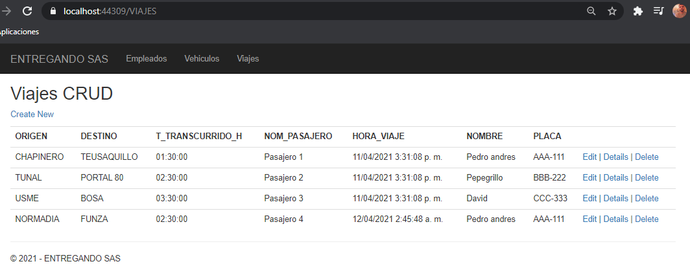
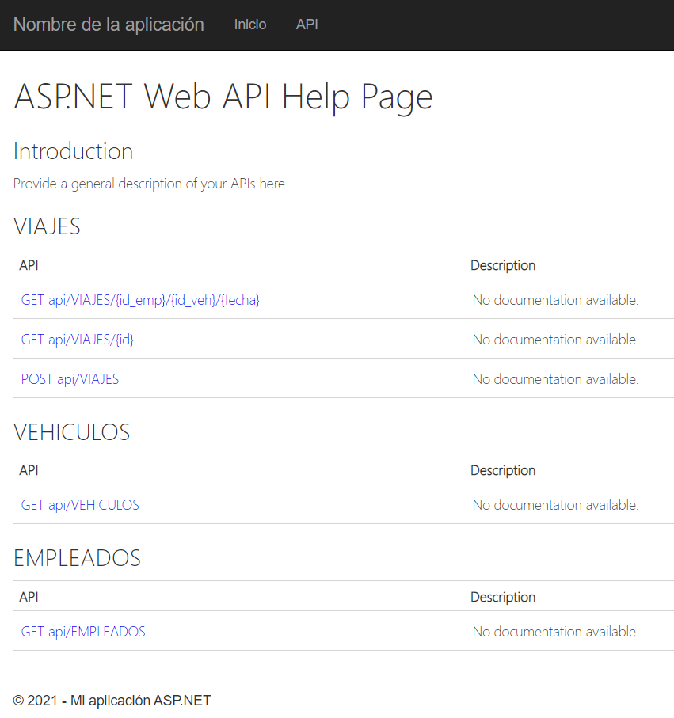
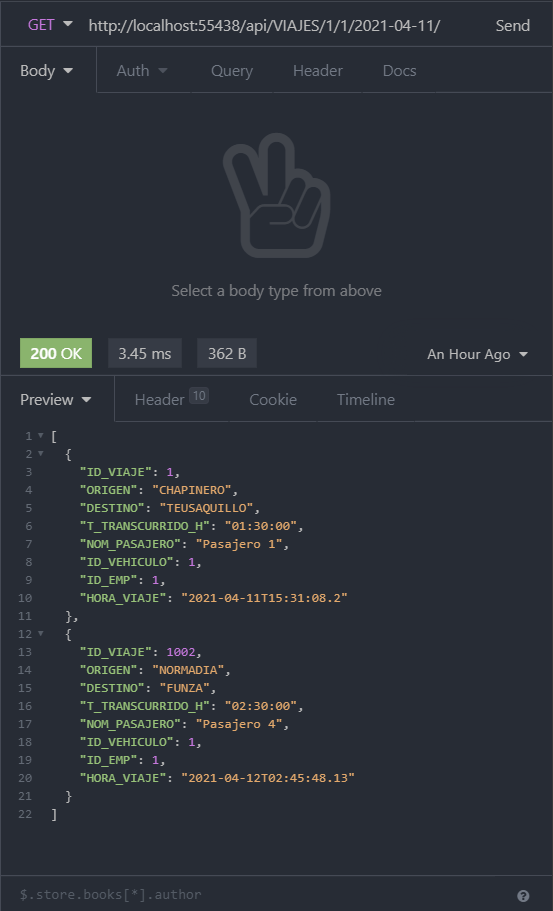
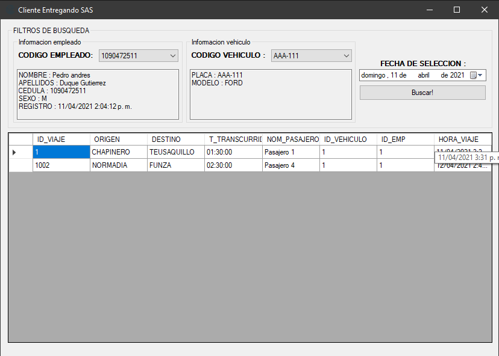

# asp.net-mvc-webapi-winform

NOTA: para los proyectos MvcEmpleados, webservice1 se debe agregar los parametros de user y admin en el `Web.config`

> metadata=res://*/EntregandoSasModel.csdl|res://*/EntregandoSasModel.ssdl|res://*/EntregandoSasModel.msl;provider=System.Data.SqlClient;provider connection string=&quot;data source=localhost;initial catalog=ENTREGANDO_SAS;user id=admin;password=;MultipleActiveResultSets=True;App=EntityFramework&quot;"


# Base de datos

> 1. Diseñe un modelo de base de datos que permita almacenar la información de la aplicación para generar reportes de los viajes y empleados.

RUTA DE SOLUCION : `./BASE DE DATOS.sql`

```sql
-- CREACION DE LA BASE DE DATOS
create database [ENTREGANDO_SAS];

-- CREACION DE LA TABLA EMPLEADOS
create table EMPLEADOS(
	ID_EMP int primary key IDENTITY(1,1),
	CEDULA bigint not null,
	NOMBRE varchar(50) not null,
	APELLIDO varchar(50) not null,
	SEXO char not null,
	F_NACIMIENTO date null,
	F_REGISTRO datetime not null
);

-- CREACION DE LA TABLA VEHICULOS
create table VEHICULOS(
	ID_VEHICULO int primary key IDENTITY(1,1),
	PLACA varchar(7) not null,
	MODELO varchar(50) not null
);

-- CREACION DE LA TABLA VIAJES
create table VIAJES(
	ID_VIAJE int primary key IDENTITY(1,1),
	ORIGEN varchar(50) not null,
	DESTINO varchar(50) not null,
	T_TRANSCURRIDO_H time not null,
	NOM_PASAJERO varchar(50) not null,
	
	-- LLAVE FORANEA DE VEHICULO
	ID_VEHICULO integer not null,
	CONSTRAINT FK_VEHICULO FOREIGN KEY (ID_VEHICULO)
    REFERENCES VEHICULOS(ID_VEHICULO),

	-- LLAVE FORANEA DE EMPLEADOS
	ID_EMP integer not null,
	CONSTRAINT FK_EMPLEADO FOREIGN KEY (ID_EMP)
    REFERENCES EMPLEADOS(ID_EMP),

	HORA_VIAJE datetime not null
);
```

# Web CRUD MVC
> 2. Diseñe una aplicación web bajo el patrón MVC, que permita realizar el CRUD (Create-Update-Delete) de los empleados.

RUTA DE SOLUCION : `./MvcEmpleados/MvcEmpleados.csproj`

Se creo una aplicacion web bajo el patron MVC, haciendo uso de entity framework para esta tarea. en el proyecto se dejaron los CRUD de las tres tablas usadas para la aplicacion

pantalla general


crud



# Procedimientos almacenados
> 3. Crear los procedimientos almacenados para obtener y registrar los viajes realizados por empleado.

RUTA DE SOLUCION : `./BASE DE DATOS.sql`

Procedimiento almacenado para obtener viajes realizados por un empleado

```sql
-- procedimiento almacenado para insertar un viaje de un empleado
CREATE PROCEDURE PgetViajesEmpleado
@idEmp int
AS
	SELECT 
		[ORIGEN],[DESTINO],[T_TRANSCURRIDO_H],[NOM_PASAJERO],[ID_VEHICULO],[ID_EMP],[HORA_VIAJE]
	FROM
		[dbo].[VIAJES]
	WHERE
		[ID_VIAJE] = @idEmp
GO
```

Procedimiento almacenado para registrar viajes realizado por un empleado

```sql
-- procedimiento almacenado para obtener los viajes de un empleado
CREATE PROCEDURE PaddViajesEmpleado
@ORIGEN varchar(50),
	@DESTINO varchar(50),
	@T_TRANSCURRIDO_H time,
	@NOM_PASAJERO varchar(50),
	@ID_VEHICULO integer,
	@ID_EMP integer
AS
	INSERT INTO [dbo].[VIAJES]
		([ORIGEN],[DESTINO],[T_TRANSCURRIDO_H],[NOM_PASAJERO],[ID_VEHICULO],[ID_EMP],[HORA_VIAJE])
	VALUES
		(@ORIGEN, @DESTINO, @T_TRANSCURRIDO_H, @NOM_PASAJERO, @ID_VEHICULO, @ID_EMP, CURRENT_TIMESTAMP)
```

# WebService 
> 4. Diseñe y desarrolle un Web Services SOAP / REST que permita obtener y registrar los viajes realizados por empleado.

RUTA DE SOLUCION : `./webservice1/webservice1.csproj`

segmento de codigo del controlador (para verlo completo ir a webservice1/Controllers/VIAJESController.cs)
```csharp
namespace webservice1.Controllers
{
    public class VIAJESController : ApiController
    {
        private ENTREGANDO_SASEntities db = new ENTREGANDO_SASEntities();

        // GET: api/VIAJES/1/1/2020-04-11
        [ResponseType(typeof(VIAJES))]
        [Route("api/VIAJES/{id_emp}/{id_veh}/{fecha}/")]
        public IHttpActionResult GetVIAJES(int id_emp, int id_veh, System.DateTime fecha)
        {
            DateTime endDate = fecha.Date.AddDays(1);
            
            IQueryable vIAJES = db.VIAJES.Where(
                viaje => viaje.ID_EMP == id_emp && 
                viaje.ID_VEHICULO == id_veh &&
                viaje.HORA_VIAJE > fecha 
            );

            if (vIAJES == null)
            {
                return NotFound();
            }

            return Ok(vIAJES);
        }

        // POST: api/VIAJES
        [ResponseType(typeof(VIAJES))]
        public IHttpActionResult PostVIAJES(VIAJES vIAJES)
        {
            if (!ModelState.IsValid)
            {
                return BadRequest(ModelState);
            }

            db.VIAJES.Add(vIAJES);
            db.SaveChanges();

            return CreatedAtRoute("DefaultApi", new { id = vIAJES.ID_VIAJE }, vIAJES);
        }
    }
}
```

api-help



insomnia-request



# Windows Form

> 5. Diseñe y desarrolle una aplicación Windows que se integre con el servicio web creado previamente para presentar la información de viajes de un empleado en una fecha y vehículo determinado.

RUTA DE SOLUCION : `./AplicacionWindows/AplicacionWindows.csproj`

segmento descriptivo del manejo de las peticiones al webservice, cada funcion recibe la ruta especifica del endpoint para consumir los datos. y los combobox son retroalimentados por otros dos endpoints para cerrar la consulta a datos que conozca el sistema.

```csharp
static async Task<List<Empleado>> GetEmpleadosAsync(string path)
{
    List<Empleado> empleado = null;
    HttpResponseMessage response = await client.GetAsync(path);
    if (response.IsSuccessStatusCode)
    {
        empleado = await response.Content.ReadAsAsync<List<Empleado>>();
    }
    return empleado;
}

static async Task<List<Vehiculo>> GetVehiculosAsync(string path)
{
    List<Vehiculo> vehiculo = null;
    HttpResponseMessage response = await client.GetAsync(path);
    if (response.IsSuccessStatusCode)
    {
        vehiculo = await response.Content.ReadAsAsync<List<Vehiculo>>();
    }
    return vehiculo;
}

static async Task<List<Viaje>> GetViajesAsync(string path)
{
    List<Viaje> viaje = null;
    HttpResponseMessage response = await client.GetAsync(path);
    if (response.IsSuccessStatusCode)
    {
        viaje = await response.Content.ReadAsAsync<List<Viaje>>();
    }
    return viaje;
}
```

Diseño de la aplicacion


